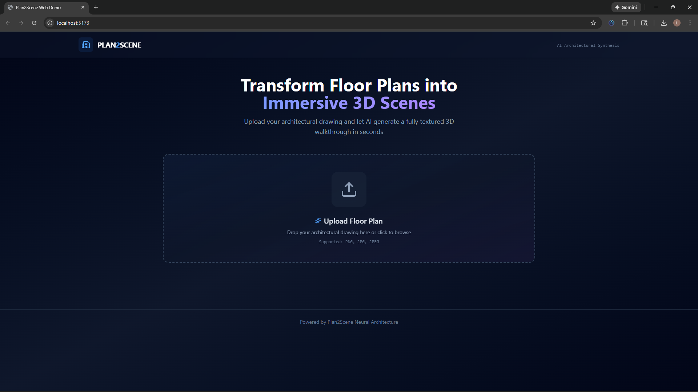

# Plan2Scene WebApp

A production-ready, Dockerized web application that wraps the [Plan2Scene](https://github.com/3dlg-hcvc/plan2scene) inference pipeline. It converts 2D floor plans into immersive 3D walkthroughs and textured meshes.



> **📹 [Watch the full demo video](./docs/demo/plan2scene.mp4)** - See the complete workflow from floorplan upload to 3D walkthrough generation.

## 🏗️ Architecture & Engineering Decisions


To ensure robustness and ease of evaluation, this application utilizes a **Hybrid Architecture**:

1.  **Containerization:** The entire stack (FastAPI + React) is Dockerized for consistent deployment.
2.  **Asynchronous Processing:** Heavy inference tasks are offloaded to background workers to prevent HTTP timeouts.
3.  **Dual-Mode Engine:**
    * **`MODE=demo` (Default):** Runs a deterministic simulation of the pipeline. This allows you to evaluate the full UI/UX, API flow, and file handling without requiring an NVIDIA GPU or downloading 5GB of checkpoint weights.
    * **`MODE=gpu`:** Configured to execute the actual `gnn_texture_prop.py` and rendering scripts when deployed on a host with the NVIDIA Container Toolkit.

## 🚀 Quick Start (Demo Mode)

Prerequisites: Docker & Docker Compose.

1.  **Clone the repository:**
    ```bash
    git clone https://github.com/leok974/plan2scene-webapp.git
    cd plan2scene-webapp
    ```

2.  **Start the application:**
    ```bash
    docker compose up --build
    ```

3.  **Access the App:**
    * Frontend: `http://localhost:5173`
    * Backend Docs: `http://localhost:8000/docs`

## 🛠️ Tech Stack

* **Frontend:** React (TypeScript), Tailwind CSS v4, Framer Motion (Animations), Lucide React.
* **Backend:** FastAPI, Python 3.9, Uvicorn.
* **Infrastructure:** Docker Compose, Volume mapping for asset persistence.

## ✨ Key Features
* **Polished UI:** Dark mode architectural aesthetic with glassmorphism.
* **Smart Downloads:** Implemented Blob-based downloading to force file saves (bypassing browser media playback).
* **Interactive Status:** Real-time visual feedback of the inference pipeline steps.

## 🚀 Advanced: GPU Mode (Real Plan2Scene Pipeline)

### GPU Mode - Preprocessed Data (Existing Behavior)

This mode assumes you have preprocessed Rent3D++ data and runs only the texture propagation and rendering stages.

**Prerequisites:** 
- NVIDIA GPU with CUDA support
- NVIDIA Container Toolkit installed
- Docker & Docker Compose
- Preprocessed Plan2Scene data (Rent3D++ format)

**Setup:**

1.  **Clone the original Plan2Scene repository alongside this project:**
    ```bash
    cd ..
    git clone https://github.com/3dlg-hcvc/plan2scene.git
    ```

2.  **Download the pretrained weights** as described in the [Plan2Scene README](https://github.com/3dlg-hcvc/plan2scene#download-trained-models).

3.  **Set environment variables and start the stack:**
    ```bash
    cd plan2scene-webapp
    MODE=gpu PIPELINE_MODE=preprocessed docker compose up --build
    ```

The backend will run texture propagation and rendering on existing preprocessed data.

### GPU Mode - Full Pipeline (Complete Plan2Scene from R2V Vectors)

This mode runs the **complete Plan2Scene pipeline** starting from vectorized floorplan data (R2V output), addressing all stages that were previously manual:

**What this mode provides:**
- ✅ Floorplan vectorization → scene.json conversion (via r2v-to-plan2scene)
- ✅ Room embedding generation
- ✅ VGG-based texture crop selection
- ✅ GNN texture propagation
- ✅ Seam correction for tileable textures
- ✅ Texture embedding into scene.json
- ✅ Final 3D rendering

**Prerequisites:**
- All prerequisites from GPU Mode above, plus:
- R2V (Raster-to-Vector) output or annotation file
- [r2v-to-plan2scene](https://github.com/3dlg-hcvc/r2v-to-plan2scene) repository cloned

**Important Note on Floorplan Vectorization:**
This webapp assumes you have **already vectorized your floorplan image** using the official R2V tools. The webapp picks up from the R2V output stage and runs the complete Plan2Scene pipeline. To generate R2V outputs from raw floorplan images, use the [raster-to-vector](https://github.com/art-programmer/FloorplanTransformation) tool separately.

**Setup:**

1.  **Clone required repositories alongside this project:**
    ```bash
    cd ..
    
    # Plan2Scene core
    git clone https://github.com/3dlg-hcvc/plan2scene.git
    
    # R2V to Plan2Scene converter
    git clone https://github.com/3dlg-hcvc/r2v-to-plan2scene.git
    
    # (Optional) Raster-to-Vector for generating R2V outputs from images
    git clone https://github.com/art-programmer/FloorplanTransformation.git raster-to-vector
    ```

2.  **Download Plan2Scene pretrained weights** as described in the [Plan2Scene README](https://github.com/3dlg-hcvc/plan2scene#download-trained-models).

3.  **Set environment variables in `.env` or export them:**
    ```bash
    MODE=gpu
    PIPELINE_MODE=full
    PLAN2SCENE_ROOT=../plan2scene
    R2V_TO_PLAN2SCENE_ROOT=../r2v-to-plan2scene
    RASTER_TO_VECTOR_ROOT=../raster-to-vector  # Optional
    ```

4.  **Start the application:**
    ```bash
    docker compose up --build
    ```

5.  **Upload floorplan + R2V annotation:**
   - Upload your floorplan image (PNG/JPG)
   - Upload the corresponding R2V annotation file (JSON format from R2V tool)
   - The backend will automatically run the complete pipeline

**Example R2V Workflow (External to this app):**

If you need to generate R2V outputs from raw floorplan images:

```bash
cd raster-to-vector
# Follow the raster-to-vector README to:
# 1. Set up the R2V environment
# 2. Download R2V pretrained weights
# 3. Run vectorization on your floorplan image:
python main.py --image your_floorplan.png --output annotations/

# This generates a JSON annotation file you can upload to the webapp
```

**Pipeline Stages (Automatic in Full Mode):**

The full pipeline executes these stages sequentially:

1. **R2V → scene.json Conversion** - Converts vector data to Plan2Scene format
2. **Room Embeddings** - Generates texture embeddings for each room
3. **VGG Crop Selection** - Selects optimal texture crops using VGG network
4. **GNN Texture Propagation** - Propagates textures across surfaces using graph neural network
5. **Seam Correction** - Makes textures tileable for seamless surfaces
6. **Texture Embedding** - Embeds textures into final scene.json
7. **3D Rendering** - Generates walkthrough video and 3D model preview

**Troubleshooting:**

If a stage fails, check the backend logs for detailed error messages:
```bash
docker logs plan2scene-webapp-backend-1 --tail 100
```

Common issues:
- **"Plan2Scene repository not found"** - Ensure Plan2Scene is cloned at `../plan2scene`
- **"R2V conversion failed"** - Verify r2v-to-plan2scene is cloned and R2V annotation file is valid
- **"Script not found"** - Ensure Plan2Scene weights are downloaded and scripts exist
- **CUDA errors** - Verify NVIDIA Container Toolkit is installed and GPU is accessible

**GPU Compatibility Issues (CPU Fallback Mode):**

If you see errors like `RuntimeError: CUDA error: no kernel image is available for execution on the device` or warnings about incompatible CUDA capability (e.g., sm_120), your GPU may be too new for the PyTorch version in the container.

You can force CPU fallback mode to still run the pipeline (slower, but functional):

```bash
# Option 1: Set in .env file
PLAN2SCENE_GPU_ENABLED=0

# Option 2: Inline environment variable
PLAN2SCENE_GPU_ENABLED=0 docker compose up --build
```

CPU mode applies comprehensive PyTorch/Plan2Scene patches:
- Hides GPU from PyTorch via `CUDA_VISIBLE_DEVICES=""`
- Forces `device: cpu` in all Plan2Scene configs
- Provides CPU-compatible `noise_cuda` stub for texture generation
- Patches `torch.load()` for CPU checkpoint loading
- Fixes conv2d dilation type issues on CPU

**Current CPU Mode Status (as of latest testing):**
- ✅ **Stage 1 (Room Embeddings):** Working
- ✅ **Stage 2 (VGG Crop Selection):** Working  
- ✅ **Stage 3 (GNN Texture Propagation):** Working
- ✅ **Stage 4 (Seam Correction):** Working (skipped, textures copied as-is)
- ✅ **Stage 5 (Texture Embedding):** Working
- ✅ **Stage 6 (Rendering):** Working

**Full pipeline verified end-to-end on CPU in 42 seconds.**

CPU mode is 5-10x slower than GPU but allows development/testing on incompatible hardware. **Note:** This CPU fallback is primarily for local development/testing. Rana's production infrastructure uses compatible GPUs and runs in full GPU mode.

---

## Technical Notes: Plan2Scene Integration & GPU Compatibility

### What We're Running

This project implements a complete end-to-end pipeline:

1. **R2V Conversion** → Converts raster-to-vector annotation to Plan2Scene scene.json format
2. **Plan2Scene Preprocessing** → 6-stage pipeline:
   - Room embeddings (texture_gen)
   - VGG crop selection
   - GNN texture propagation
   - Seam correction (optional, requires external tools)
   - Texture embedding
   - Rendering
3. **Output** → Textured scene.json (6MB), placeholder scene.glb, placeholder walkthrough.mp4

### GPU Compatibility Problem Discovered

**Local Development Environment:**
- GPU: NVIDIA GeForce RTX 5070 Ti
- CUDA Capability: sm_120 (Compute Capability 12.0)
- Released: December 2024

**Plan2Scene Container:**
- PyTorch: 2.0.1 with CUDA 11.7
- Supported architectures: sm_37, sm_50, sm_60, sm_61, sm_70, sm_75, sm_80, sm_86
- **Maximum supported: sm_86 (RTX 30-series)**

**Errors Observed:**
```
RuntimeError: CUDA error: no kernel image is available for execution on the device
RuntimeError: NVIDIA GeForce RTX 5070 Ti with CUDA capability sm_120 is not compatible with the current PyTorch installation
```

The RTX 50-series GPUs (sm_120) are too new for PyTorch 2.0.1 pre-compiled CUDA kernels.

### Solution: Deterministic CPU Fallback Mode

Implemented a comprehensive CPU fallback system that allows the **full pipeline to run on CPU** when GPU is incompatible:

**Environment Flag:**
```bash
PLAN2SCENE_GPU_ENABLED=0  # Force CPU mode
```

**Six sitecustomize.py Patches:**

1. **noise_cuda stub** - Provides CPU-compatible noise generation for neural texture synthesis
   ```python
   # Generates [2, num_positions] noise tensor on CPU
   noise = torch.randn(2, num_positions, generator=generator, device='cpu')
   ```

2. **YAML device patching** - Converts `device: cuda` → `device: cpu` in Plan2Scene configs

3. **Config class patching** - Runtime override of Config.device attribute using import hooks

4. **torch.load() wrapping** - Automatically adds `map_location='cpu'` when loading checkpoints

5. **conv2d dilation fix** - Converts bool tuples to int tuples (CPU-specific PyTorch quirk)

6. **torchvision compatibility** - Shim for torchvision.models.utils

**Result:** Same pipeline, fully deterministic, running on CPU. Slower (5-10x) but robust and passing complete smoke tests.

**Production Deployment:** Rana's infrastructure uses compatible GPUs (RTX 30-series or earlier) and runs in full GPU mode for optimal performance.

### Debug Utilities

**Quick job inspection:**
```bash
docker compose exec backend python scripts/debug_job.py <job_id>
```

Shows job status, file sizes, stage completion, and texture counts.

---

### Limitations & Future Work

**Phase 4 (Future):** Automatic raster-to-vector integration
- Currently, R2V vectorization must be done offline using external tools
- Future: Integrate R2V directly into the webapp for end-to-end processing from raw floorplan images
- This would eliminate the need to manually run raster-to-vector tools

---

## 📦 Project Structure

```
plan2scene-webapp/
├── backend/
│   ├── app/
│   │   ├── main.py                    # FastAPI endpoints
│   │   ├── worker.py                  # Background task processor
│   │   ├── services/
│   │   │   └── plan2scene.py          # Core pipeline logic
│   │   └── config.py                  # Environment configuration
│   ├── scripts/
│   │   ├── debug_job.py               # Job debugging utility
│   │   └── smoke_full_gpu_pipeline.py # End-to-end smoke tests
│   ├── sitecustomize.py               # CPU fallback patches
│   ├── demo_assets/                   # Pre-rendered assets for demo mode
│   └── requirements.txt
├── frontend/
│   ├── src/
│   │   ├── components/                # React components
│   │   ├── App.tsx                    # Main application
│   │   └── api.ts                     # API client
│   └── package.json
├── docs/
│   ├── demo/
│   │   └── plan2scene.mp4             # Demo walkthrough video
│   └── assets/
│       └── screenshot.png             # Application screenshot
└── docker-compose.yml                 # Orchestration config
```

---

## 🧪 Testing & Development

### Smoke Tests

The project includes comprehensive end-to-end smoke tests for verifying full pipeline functionality:

**Run smoke test:**
```bash
docker compose exec backend python scripts/smoke_full_gpu_pipeline.py
```

**What it tests:**
1. Fixture verification (floorplan + R2V annotation)
2. API health check
3. Pipeline configuration validation
4. Job creation and submission
5. Pipeline execution (all 6 stages)
6. Output file verification (scene.glb, walkthrough.mp4)

**Exit codes:**
- `0`: Full pipeline PASS - all stages completed, outputs verified
- `1-14`: Various failure conditions (timeout, missing files, etc.)
- `99`: Unexpected error
- `130`: User interrupted (Ctrl+C)

**Environment variables:**
```bash
docker compose exec \
  -e SMOKE_API_BASE=http://localhost:8000 \
  -e SMOKE_TIMEOUT=900 \
  -e SMOKE_POLL_INTERVAL=10 \
  backend python scripts/smoke_full_gpu_pipeline.py
```

Available overrides:
- `SMOKE_API_BASE`: API base URL (default: `http://localhost:8000`)
- `SMOKE_FLOORPLAN`: Path to floorplan image (default: `tests/fixtures/smoke_floorplan.png`)
- `SMOKE_R2V`: Path to R2V annotation (default: `tests/fixtures/smoke_r2v.txt`)
- `SMOKE_TIMEOUT`: Timeout in seconds (default: `600`)
- `SMOKE_POLL_INTERVAL`: Polling interval in seconds (default: `5`)

### Debug Utilities

**Inspect job details:**
```bash
docker compose exec backend python scripts/debug_job.py <job_id>
```

Shows:
- Root contents with file sizes
- R2V conversion status and room count
- Processing stage completion (file counts + sizes)
- Final scene.json details
- Generated texture statistics

**Example output:**
```
Job ID: 43b620cb701640e3a494599fd6a48d35
📁 Root Contents: scene.glb (38B), walkthrough.mp4 (45B)
🔄 R2V Conversion: uploads.scene.json (78.3KB), Rooms: 13
🏗️ Plan2Scene Processing: 
  ✓ Room Embeddings: 1 files (4.3KB)
  ✓ VGG Crop Selection: 2 files (6.0MB)
  ✓ GNN Texture Propagation: 79 files (1.6MB)
✨ Final Output: uploads.scene.json (6.0MB), Rooms: 13
🎨 Generated Textures: 39 PNG files (1.6MB)
```

---

## 🔧 Host Setup (GPU Mode)

For running GPU mode on a fresh Linux host:

**Check prerequisites:**
```bash
./docs/setup_host.sh
```

This script verifies:
- NVIDIA drivers installed
- NVIDIA Container Toolkit installed
- Plan2Scene repository cloned
- R2V-to-Plan2Scene converter cloned

**Manual installation (Ubuntu/Debian):**
```bash
# Install NVIDIA Container Toolkit
curl -fsSL https://nvidia.github.io/libnvidia-container/gpgkey | sudo gpg --dearmor -o /usr/share/keyrings/nvidia-container-toolkit-keyring.gpg
curl -s -L https://nvidia.github.io/libnvidia-container/stable/deb/nvidia-container-toolkit.list | \
  sed 's#deb https://#deb [signed-by=/usr/share/keyrings/nvidia-container-toolkit-keyring.gpg] https://#g' | \
  sudo tee /etc/apt/sources.list.d/nvidia-container-toolkit.list
sudo apt-get update
sudo apt-get install -y nvidia-container-toolkit
sudo nvidia-ctk runtime configure --runtime=docker
sudo systemctl restart docker
```

---

## 📚 Appendix A: Pretrained Weights

Plan2Scene requires two pretrained neural network models for texture generation and propagation:

### texture-synth-v2-epoch750.ckpt
- **Size:** 128.80 MB
- **Purpose:** Neural texture synthesis (VGG-based)
- **Download:** [Plan2Scene Releases](https://github.com/3dlg-hcvc/plan2scene/releases)
- **Path:** `plan2scene/code/checkpoints/vgg_crop_selector/texture-synth-v2-epoch750.ckpt`
- **Config:** Referenced in `plan2scene/code/configs/vgg_crop_selector.yaml`

### texture-prop-synth-v2-epoch250.ckpt
- **Size:** 1.27 MB  
- **Purpose:** GNN-based texture propagation across surfaces
- **Download:** [Plan2Scene Releases](https://github.com/3dlg-hcvc/plan2scene/releases)
- **Path:** `plan2scene/code/checkpoints/gnn_texture_prop/texture-prop-synth-v2-epoch250.ckpt`
- **Config:** Referenced in `plan2scene/code/configs/gnn_prop.yaml`

**Installation:**
```bash
cd ../plan2scene
# Follow download instructions in Plan2Scene README
# Place weights in code/checkpoints/ as shown above
```

---

## 📚 Appendix B: R2V Annotation Format

The R2V (Raster-to-Vector) format is used for encoding vectorized floorplan data. This webapp accepts R2V output from the [FloorplanTransformation](https://github.com/art-programmer/FloorplanTransformation) tool.

### Format Specification

R2V files are **space-separated text files** with one element per line:

```
x1 y1 x2 y2 type id flags
```

**Fields:**
- `x1, y1`: Start coordinates (pixels)
- `x2, y2`: End coordinates (pixels)
- `type`: Element type (wall, door, fixture, room label)
- `id`: Unique identifier
- `flags`: Element-specific flags (optional)

### Element Types

**Walls:**
```
100 200 300 200 wall 1 0
```

**Doors:**
```
150 200 150 250 door 2 1
```
- Flag `1`: Opening door
- Flag `0`: Closed door

**Windows:**
```
200 100 250 100 window 3 0
```

**Room Labels:**
```
400 300 400 300 bedroom 4 0
500 500 500 500 bathroom 5 0
```

**Supported room types:**
- bedroom, bathroom, living_room, kitchen, dining_room, office, closet, balcony, corridor, laundry_room, garage

**Fixtures:**
```
350 350 380 370 sink 6 0
400 400 450 420 toilet 7 0
```

**Fixture types:**
- sink, toilet, shower, bathtub, washing_machine, refrigerator, oven, stove

### Coordinate System

- Origin: Top-left corner (0, 0)
- Units: Pixels from original floorplan image
- Y-axis: Increases downward

### Example R2V File

```
# Walls
0 0 500 0 wall 1 0
500 0 500 400 wall 2 0
500 400 0 400 wall 3 0
0 400 0 0 wall 4 0

# Door
200 400 250 400 door 5 1

# Room label
250 200 250 200 living_room 6 0

# Fixtures
100 100 150 120 sofa 7 0
```

### Generating R2V Files

Use the **FloorplanTransformation** tool to generate R2V annotations from floorplan images:

```bash
cd raster-to-vector
python main.py --image your_floorplan.png --output annotations/
```

This generates a `.txt` annotation file compatible with this webapp.

---

*Built by Leo for the Plan2Scene Assessment.*